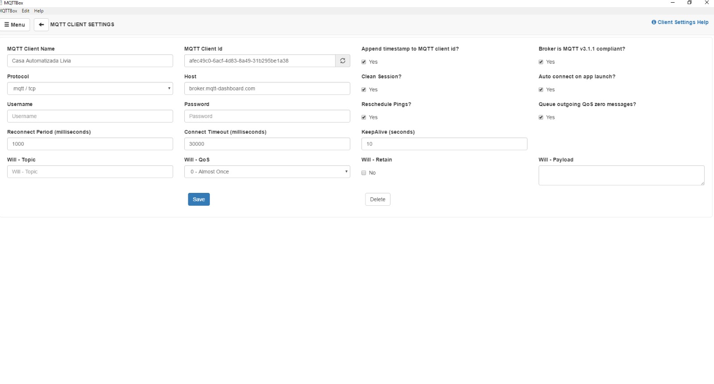

# Lâmpada inteligente

## Configuração do projeto

### Configuração do MQTTBox
Para iniciar a configuração do projeto, primeiro precisamos instalar o MQTTBox no nosso computador. Ele é utilizado para testar e depurar conexões MQTT. Você pode fazer isso acessando o link a seguir:

``
https://apps.microsoft.com/store/detail/mqttbox/9NBLGGH55JZG?hl=pt-br&gl=br
``

Após a instalação, iremos configurar o MQTTBox para o ESP8266

E por fim, configura-se o Subscribe

### Configuração do MQTTDash
Agora, precismos instalar o aplicativo que será utilizado para controlar os leds (lâmpadas) 

Para instalar ele, baixe-o através desse link. É um APK.

``
  https://m.apkpure.com/br/mqtt-dash-iot-smart-home/net.routix.mqttdash
``

Para configurá-lo, é necessário seguir e escrever os textos igual está nos screenshoots.

## O software desenvolvido e código fonte
O código fonte Será dividido em partes para facilitar a explicação do mesmo. 

Aqui nós definimos as bibliotecas, pinos, constantes e variáveis.

 Agora vamos estabelecer a conexão com o broker, para isso precisamos fazer as configurações de Internet, inserimos nosso SSID (nome da rede) e password (senha da rede). 

No setup, definimos as configurações para o DHT realizar as leituras

Ainda no setup, definimos os pinos que estão os leds

Por fim, definimos como será a conexão com o wifi e o que acontecerá se der erro ou se a conexão for bem sucedida.

## A descrição do hardware utilizado

### Hardware
1. Placa NodeMCU V3: É uma placa de desenvolvimento baseada no chip ESP8266, que possui conectividade com o Wi-Fi.
2. LEDs: São utilizados para simular as lâmpadas. Os LEDs são conectados aos pinos GPIO da placa NodeMCU para controle individual.
3. Resistores de 220 ohms: São utilizados em série com os LEDs para limitar a corrente elétrica e proteger os componentes de queimarem.
4. Protoboard de 400 pontos: É uma placa de circuito impresso com orifícios nos quais os componentes podem ser inseridos e interconectados.

### Conexão de Hardware

Os LEDs são conectados aos pinos GPIO da placa NodeMCU, utilizando os resistores de 220 ohms em série para cada LED.
Os LEDs são conectados em um circuito paralelo, onde cada LED possui uma conexão independente.

### Protocolo MQTT

1. O MQTT é um protocolo leve e eficiente para comunicação entre dispositivos IoT.
O NodeMCU V3 atua como um cliente MQTT e se conecta a um broker MQTT, que é um intermediário responsável por receber e encaminhar as mensagens.
2. O aplicativo MQTT Dash atua como um cliente MQTT e se conecta ao mesmo broker MQTT.
3. O NodeMCU V3 e o aplicativo MQTT Dash devem usar as mesmas credenciais de conexão (endereço do broker MQTT, porta, nome de usuário e senha) para estabelecer a conexão.
Funcionamento:

4. O NodeMCU V3 é programado para se conectar ao broker MQTT e se inscrever em um ou mais tópicos MQTT específicos.
Quando o aplicativo MQTT Dash envia um comando para acender ou apagar uma lâmpada específica, ele publica uma mensagem MQTT contendo o tópico e o payload apropriados.
O broker MQTT recebe a mensagem e a encaminha para o NodeMCU V3.

5. Com base no tópico recebido, o NodeMCU V3 identifica qual LED deve ser controlado e realiza a ação correspondente (acender ou apagar).
O NodeMCU V3 também pode publicar mensagens MQTT para relatar o status das lâmpadas, permitindo que o aplicativo MQTT Dash exiba o estado atual das lâmpadas.